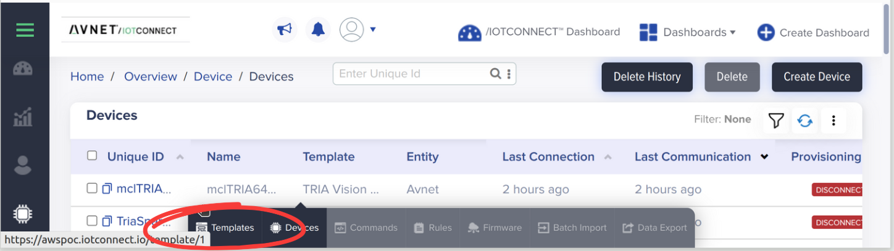
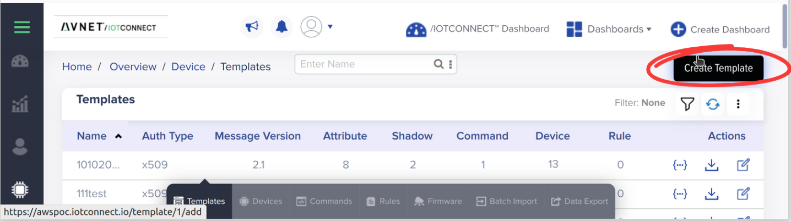
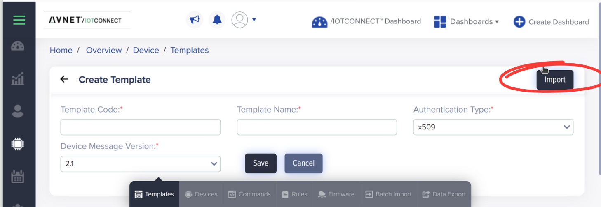
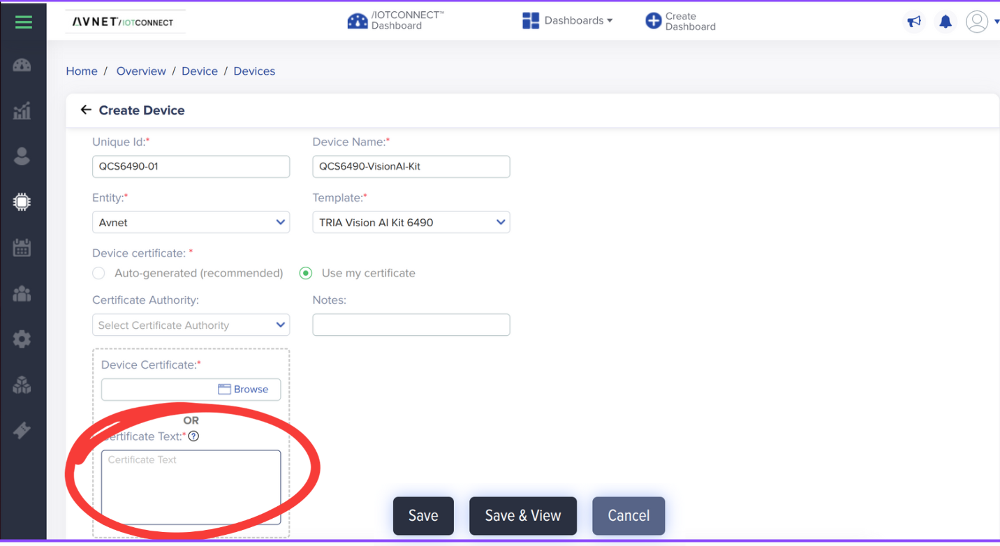
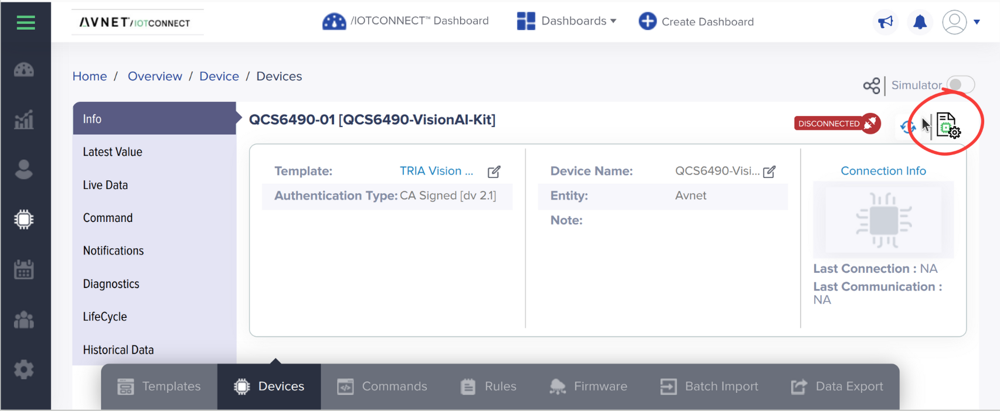

## QCS6490 Vision AI Demo: /IOTCONNECT Quickstart

### Table of Contents

* [Introduction](#introduction)
* [Prerequisites](#prerequisites)
* [Cloud Account & Device Template Setup](#cloud-account--device-template-setup)
* [Device Setup & Certificate Provisioning](#device-setup--certificate-provisioning)
* [Download Device Configuration](#download-device-configuration)
* [Run Quickstart to Connect Device](#run-quickstart-to-connect-device)
* [Launch the /IOTCONNECT-Enabled Demo](#launch-the-iotconnect-enabled-demo)
* [Telemetry & Commands](#telemetry--commands)

  * [Telemetry Fields](#telemetry-fields)
  * [Supported Commands](#supported-commands)

    * [start\_demo `<camera>` `<pipeline>`](#start_demo-camera-pipeline)
    * [stop\_demo `<camera>`](#stop_demo-camera)
  * [How to Use Telemetry & Commands](#how-to-use-telemetry--commands)
* [Summary](#summary)
* [Links & References](#links--references)

---

## Introduction

This Quickstart guide walks you through:

1. Importing the **TRIA Vision AI Kit 6490** Device Template into /IOTCONNECT.
2. Running the Quickstart flow on the target (under `/var/rootdirs/opt/QCS6490-Vision-AI-Demo/`) to generate device certificates.
3. Creating a Device in /IOTCONNECT using that certificate.
4. Downloading the Device Configuration JSON from the portal and pasting it back into the Quickstart script.
5. Placing the final certificate, private key, and JSON into `/var/rootdirs/opt/QCS6490-Vision-AI-Demo/iotc_config/`.
6. Launching the Vision AI demo, which sends telemetry and accepts commands via /IOTCONNECT.

---

## Prerequisites

* A working **Bash shell** on your host machine (Linux or Windows with Git Bash).
* **`adb` (Android Debug Bridge)** installed on your host (to communicate with the Vision AI Kit via USB).

  * On Ubuntu: `sudo apt install android-tools-adb`
  * On Windows: download and install from [https://developer.android.com/studio/releases/platform-tools](https://developer.android.com/studio/releases/platform-tools).
* **Python 3** (3.6+) with `pip` on the Vision AI Kit.
* **`curl`** or **`wget`** on the Vision AI Kit (for fetching scripts).
* An active **/IOTCONNECT** subscription (AWS- or Azure-based). If you don’t already have one, sign up for a free trial:

  * AWS: `https://subscription.iotconnect.io/subscribe?cloud=aws`
  * Azure: `https://subscription.iotconnect.io/subscribe?cloud=azure`
* (Optional) If you previously installed the full IoTConnect Python SDK on the device, use a separate venv for the Lite SDK.

---

## Cloud Account & Device Template Setup

Before device creation, import the Device Template matching the TRIA Vision AI Kit 6490.

1. **Log in** to your /IOTCONNECT portal (AWS or Azure version).

2. Navigate to **Devices → Templates**.

   

3. Click **Create Template** (top-right).

   

4. Click **Import** (top-right) and upload `iotconnect/tria_6490_device_template.JSON`.

   

5. Click **Save**. You should now have a template named **TRIA Vision AI Kit 6490**.

   * **Auth Type**: x509
   * **Message Version**: 2.1
   * **Attributes**: 7 (for telemetry fields)
   * **Commands**: 2 (`start_demo`, `stop_demo`)

> **Tip**: If you need to modify telemetry or commands, use the edit button in the template listing located in the 
> actions section.

---

## Device Setup & Certificate Provisioning

All Quickstart steps should be run under `/var/rootdirs/opt/QCS6490-Vision-AI-Demo/` on the Vision AI Kit.

1. **ADB Connectivity**: On your host, ensure the Vision AI Kit is connected via USB and ADB is running:

   ```bash
   adb devices
   ```

   Confirm that your device ID appears.

2. **Create project folder on-device**:

   ```bash
   adb shell mkdir -p /var/rootdirs/opt/QCS6490-Vision-AI-Demo/iotc_config
   ```

3. **Install Lite SDK on-device**:

   ```bash
   adb shell
   python3 -m pip install iotconnect-sdk-lite
   exit
   ```

4. **Fetch and run Quickstart setup on-device**:

   ```bash
   adb shell
   cd /var/rootdirs/opt/QCS6490-Vision-AI-Demo/iotc_config
   curl -sOJ 'https://raw.githubusercontent.com/avnet-iotconnect/iotc-python-lite-sdk/refs/heads/main/scripts/quickstart.sh'
   chmod +x quickstart.sh
   bash ./quickstart.sh
   ```

   The script will generate a certificate to be pasted into the steps below.

---

## Create Device in IOTCONNECT

1. Log in to the portal and go to **Devices → Devices**, then click **Create Device**.
2. Fill out:

   * **Unique Id**: Must match `uid` in your JSON (e.g. `QCS6490-01`).
   * **Device Name**: `QCS6490-VisionAI-Kit`.
   * **Entity**: `Avnet` (or your company).
   * **Template**: `TRIA Vision AI Kit 6490`.
3. Under **Device certificate**, choose **Use my certificate** and paste the entire contents of the certificate generated by the script.
     
4. Click **Save & View**.
5. On the Device Info page, click the Device Configuration icon to download the JSON file and past back into the script.
        

Now verify that `/var/rootdirs/opt/QCS6490-Vision-AI-Demo/iotc_config/` contains:

```
device-cert.pem

device-pkey.pem

iotcDeviceConfig.json
```

---

## Launch the /IOTCONNECT-Enabled Demo

With the device connected, push and run the demo under `/var/rootdirs/opt/QCS6490-Vision-AI-Demo/`:

1. **Push demo code** (from host):

   ```bash
   adb push visionai-iotc.py /var/rootdirs/opt/QCS6490-Vision-AI-Demo/
   adb push launch_visionai_with_env.sh /var/rootdirs/opt/QCS6490-Vision-AI-Demo/
   ```

2. **Run the launcher on-device**:

   ```bash
   adb shell
   cd /var/rootdirs/opt/QCS6490-Vision-AI-Demo/
   chmod +x launch_visionai_with_env.sh
   sudo bash ./launch_visionai_with_env.sh
   ```

   * During the 3-second countdown, **press “i”** to run `visionai-iotc.py`.
   * If no key is pressed, `visionai.py` (local demo) runs.

3. **Verify output**:

   ```
   [IOTCONNECT] Connecting to MQTT broker…
   [IOTCONNECT] Connected (ClientID: QCS6490-01)
   [IOTCONNECT] Sending initial telemetry…
   …
   ```

Your Vision AI Kit is now streaming telemetry to /IOTCONNECT.

---

## Telemetry & Commands

Once connected, `visionai-iotc.py` sends telemetry every 5 seconds and listens for two commands: `start_demo` and `stop_demo`.

### Telemetry Fields

Each payload includes these numeric fields:

* **cpu\_usage** – CPU utilization (0–100)
* **gpu\_usage** – GPU utilization (0–100)
* **memory\_usage** – RAM utilization (0–100)
* **cpu\_temp** – CPU temperature (°C or sensor units)
* **gpu\_temp** – GPU temperature (°C or sensor units)
* **memory\_temp** – Memory temperature (°C or sensor units)
* **critical** – A fixed threshold (set to 85)

<details>
<summary>Example telemetry JSON</summary>

```json
{
  "cpu_usage": 12.3,
  "gpu_usage": 7.8,
  "memory_usage": 45.6,
  "cpu_temp": 55.0,
  "gpu_temp": 50.2,
  "memory_temp": 48.7,
  "critical": 85
}
```

</details>

> Under the hood (from `visionai-iotc.py`):
>
> ```python
> telemetry = {
>   "cpu_usage": sample_data.get(CPU_UTIL_KEY, 0),
>   "gpu_usage": sample_data.get(GPU_UTIL_KEY, 0),
>   "memory_usage": sample_data.get(MEM_UTIL_KEY, 0),
>   "cpu_temp": sample_data.get(CPU_THERMAL_KEY, 0),
>   "gpu_temp": sample_data.get(GPU_THERMAL_KEY, 0),
>   "memory_temp": sample_data.get(MEM_THERMAL_KEY, 0),
>   "critical": 85,
> }
> self.iotc.send_telemetry(telemetry)
> ```

> Confirm these under **Devices→Telemetry** in /IOTCONNECT.

---

### Supported Commands

The demo listens for `start_demo` and `stop_demo` commands. On receipt, it logs and acknowledges back to /IOTCONNECT.

#### start\_demo `<camera>` `<pipeline>`

* **Purpose**: Switch the specified camera (`cam1` or `cam2`) to a demo pipeline (1–6).
* **Arguments**:

  1. `camera` – `cam1` or `cam2` (case-insensitive)
  2. `pipeline` – string `"1"`–`"6"`
* **Behavior**:

  ```python
  camera = command.command_args[0].lower()
  pipeline = command.command_args[1].lower()
  mapping = {"1":1, "2":2, "3":3, "4":4, "5":5, "6":6}
  idx = mapping.get(pipeline)
  if camera == 'cam1':
      GLib.idle_add(self.eventHandler.demo_selection0.set_active, idx)
      msg = f"CAM1 started {pipeline}"
  elif camera == 'cam2':
      GLib.idle_add(self.eventHandler.demo_selection1.set_active, idx)
      msg = f"CAM2 started {pipeline}"
  else:
      raise ValueError(f"Invalid camera: {camera}")
  self.iotc.send_command_ack(command, C2dAck.CMD_SUCCESS_WITH_ACK, msg)
  ```
* **Portal Example**:

  1. Go to **Devices→Devices**, select device, **Commands→Send Command**.
  2. **Command name**: `start_demo`
  3. **Arguments**: `["cam1","2"]`
  4. **Submit**.
  5. On-device:

     ```
     [IOTCONNECT] Command received: start_demo
     Received command start_demo ['cam1','2']
     CAM1 started 2
     ```
  6. **Acknowledgment** shows `SUCCESS_WITH_ACK`, message `"CAM1 started 2"`, and GUI updates.

#### stop\_demo `<camera>`

* **Purpose**: Stop the demo on a camera (sets dropdown to “Off”).
* **Arguments**:

  1. `camera` – `cam1` or `cam2`
* **Behavior**:

  ```python
  camera = command.command_args[0].lower()
  if camera == 'cam1':
      GLib.idle_add(self.eventHandler.demo_selection0.set_active, 0)
      msg = "CAM1 demo stopped"
  elif camera == 'cam2':
      GLib.idle_add(self.eventHandler.demo_selection1.set_active, 0)
      msg = "CAM2 demo stopped"
  else:
      raise ValueError(f"Invalid camera: {camera}")
  self.iotc.send_command_ack(command, C2dAck.CMD_SUCCESS_WITH_ACK, msg)
  ```
* **Portal Example**:

  1. **Command name**: `stop_demo`
  2. **Arguments**: `["cam2"]`
  3. **Submit**.
  4. On-device:

     ```
     [IOTCONNECT] Command received: stop_demo
     Received command stop_demo ['cam2']
     CAM2 demo stopped
     ```
  5. **Ack**: `SUCCESS_WITH_ACK`, message `"CAM2 demo stopped"`, GUI resets.

> Under the hood:
>
> ```python
> def handle_iotconnect_command(self, command):
>     name = command.command_name
>     if name == 'start_demo': <logic>  
>     elif name == 'stop_demo': <logic>
>     else:
>         self.iotc.send_command_ack(command, C2dAck.CMD_FAILED, "Unknown command")
> ```

---

### How to Use Telemetry & Commands

1. **Confirm telemetry**:

   * In /IOTCONNECT, **Devices→Telemetry**, select your device; expect a JSON every 5 seconds.
   * If missing: ensure `/var/rootdirs/opt/QCS6490-Vision-AI-Demo/iotc_config/` has `device-cert.pem`, `device-pkey.pem`, `iotcDeviceConfig.json`, and that the device shows **Active**.

2. **Send commands**:

   * In **Devices→Devices**, select device, click **Commands→Send Command**.
   * For `start_demo`, args `["cam1","3"]`; for `stop_demo`, `["cam2"]`.
   * Click **Submit**; check **Acknowledgments** for `SUCCESS_WITH_ACK`.

3. **Pipeline reference**:

   ```
   0: Off
   1: AI Classification
   2: AI Object Detection
   3: AI Pose Estimation
   4: AI Semantic Segmentation
   5: GPU Stress Test
   6: Memory Benchmark
   ```

---

## Summary

* **Template**: Import `iotconnect/tria_6490_device_template.JSON` into /IOTCONNECT.
* **Quickstart**: On-device under `/var/rootdirs/opt/QCS6490-Vision-AI-Demo/iotc_config/`, run:

  ```bash
  curl -sOJ 'https://raw.githubusercontent.com/avnet-iotconnect/iotc-python-lite-sdk/refs/heads/main/scripts/quickstart.sh' && bash quickstart.sh
  ```

  * Copy generated PEMs, paste into Device Creation form.
  * Copy downloaded JSON, paste back in Quickstart.
* **Device Creation**: Use the generated `device-cert.pem` and `device-pkey.pem` under **Use my certificate**, then **Save & View**.
* **Connect**: Ensure `iotcDeviceConfig.json` is in `iotc_config/` and run Quickstart to activate.
* **Launch Demo**: Under `/var/rootdirs/opt/QCS6490-Vision-AI-Demo/`, run `sudo bash launch_visionai_with_env.sh`, press “i” for IoTConnect demo.
* **Verify**:

  * Check telemetry in portal.
  * Send `start_demo`/`stop_demo` to control camera demos.

Now your QCS6490 Vision AI Kit is fully integrated with /IOTCONNECT.

---

## Links & References

* **TRIA 6490 Device Template JSON** (raw):
  [https://raw.githubusercontent.com/mlamp99/QCS6490-Vision-AI-Demo/main/iotconnect/tria\_6490\_device\_template.JSON](https://raw.githubusercontent.com/mlamp99/QCS6490-Vision-AI-Demo/main/iotconnect/tria_6490_device_template.JSON)
* **Avnet Official README**:
  [https://github.com/Avnet/QCS6490-Vision-AI-Demo/blob/main/README.md](https://github.com/Avnet/QCS6490-Vision-AI-Demo/blob/main/README.md)
* **/IOTCONNECT Python Lite SDK**:
  [https://github.com/avnet-iotconnect/iotc-python-lite-sdk](https://github.com/avnet-iotconnect/iotc-python-lite-sdk)
* **Subscription Links**:

  * AWS: `https://subscription.iotconnect.io/subscribe?cloud=aws`
  * Azure: `https://subscription.iotconnect.io/subscribe?cloud=azure`
